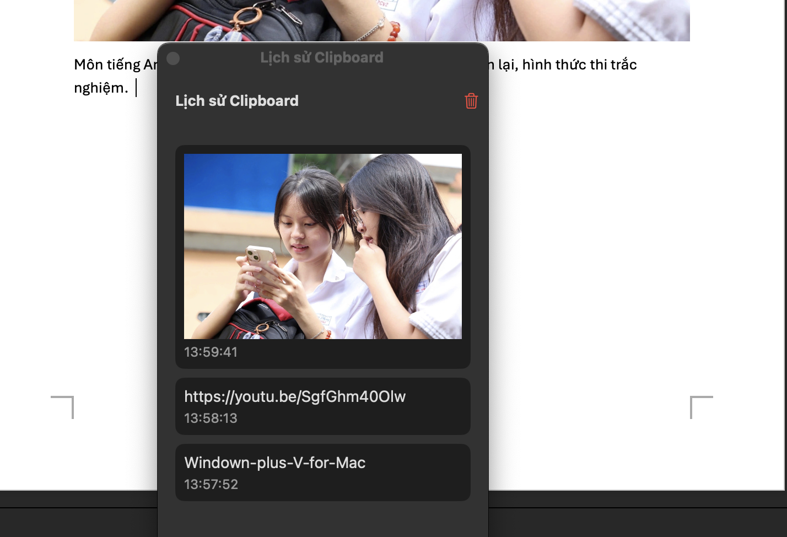
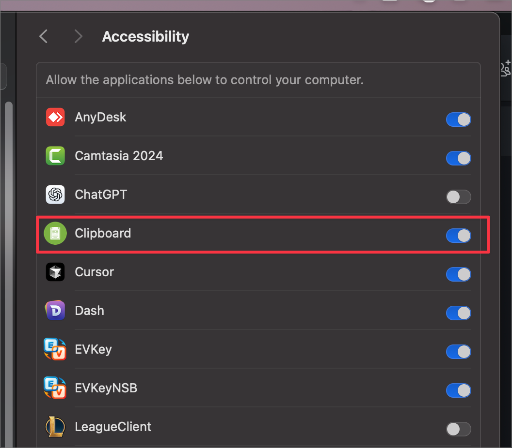

# Windown + V For Mac - Trình quản lý clipboard cho macOS

## Giới thiệu

Clipboard là một ứng dụng macOS nhỏ gọn, hiệu quả giúp bạn quản lý và truy cập nhanh lịch sử clipboard. Ứng dụng được thiết kế để hoạt động một cách im lặng trong thanh menu, luôn sẵn sàng khi bạn cần.

Được phát triển bởi [Nguyễn Xuân Hoà](https://github.com/nguyenxuanhoa493) với mục tiêu tạo ra công cụ đơn giản nhưng mạnh mẽ để nâng cao hiệu suất làm việc hàng ngày trên macOS.

## Demo

  

### Giao diện ứng dụng

## Tính năng

-   **Lưu trữ lịch sử clipboard**: Tự động lưu trữ các mục đã sao chép
-   **Truy cập nhanh**: Xem và sử dụng lại các mục đã sao chép trước đó
-   **Phím tắt**: Mở nhanh ứng dụng bằng phím tắt (Control+V)
-   **Giao diện tối giản**: Giao diện người dùng đơn giản, dễ sử dụng
-   **Hỗ trợ chữ và hình ảnh**: Lưu cả văn bản và hình ảnh trong lịch sử
-   **Tự động sắp xếp**: Các mục được sử dụng thường xuyên sẽ tự động lên đầu danh sách
-   **Paste nhanh**: Tự động paste nội dung khi chọn từ lịch sử

## Yêu cầu hệ thống

-   macOS 12.0 trở lên
-   Khoảng 1MB dung lượng đĩa

## Change log

### Version 1.4

-   Tự động paste nội dung khi chọn từ lịch sử
-   Tự động di chuyển mục được sử dụng lên đầu danh sách
-   Cải thiện hiệu suất và trải nghiệm người dùng

### Version 1.3

-   Thêm nút xóa toàn bộ lịch sử clipboard
-   Tự động ẩn cửa sổ danh sách khi click ra ngoài

## Cài đặt

1. Tải xuống file `Clipboard.dmg` từ [trang Releases](https://github.com/nguyenxuanhoa493/Windown-plus-V-for-Mac/releases)
2. Mở file DMG và kéo ứng dụng Clipboard vào thư mục Applications
3. Dùng Teminal gõ xattr -cr /Applications/Clipboard.app
4. Mở ứng dụng từ Launchpad hoặc thư mục Applications
5. Cho phép sử dụng trợ năng
   

## Sử dụng

1. Khởi động ứng dụng
2. Biểu tượng Clipboard sẽ xuất hiện trong thanh menu
3. Nhấp vào biểu tượng để xem lịch sử clipboard
4. Nhấp vào một mục để tự động paste nó vào vị trí con trỏ
5. Hoặc sử dụng phím tắt Control+V để mở ứng dụng

## Liên hệ & Hỗ trợ

Nếu bạn gặp vấn đề hoặc có câu hỏi, vui lòng:

-   Email: Nguyenxuanhoa493@gmail.com
-   Telegram: [@xuanhoa493](http://t.me/xuanhoa493)

---

Nếu bạn thấy dự án hữu ích, hãy cân nhắc [ủng hộ tác giả một ly cà phê](Sources/Resources/cafe.jpg) ☕
