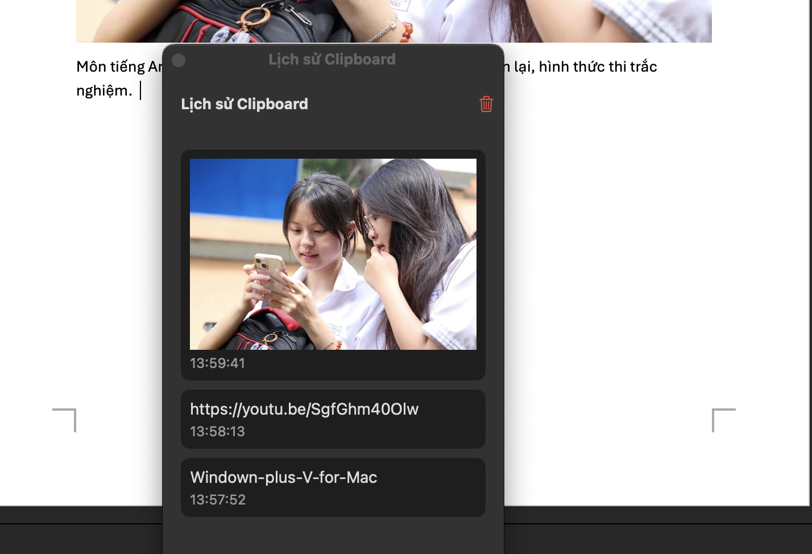

# Windown + V For Mac - Trình quản lý clipboard cho macOS

## Giới thiệu

Clipboard là một ứng dụng macOS nhỏ gọn, hiệu quả giúp bạn quản lý và truy cập nhanh lịch sử clipboard. Ứng dụng được thiết kế để hoạt động một cách im lặng trong thanh menu, luôn sẵn sàng khi bạn cần.


## Demo

[](https://youtu.be/SgfGhm40Olw)

### Giao diện ứng dụng



## Tính năng chính

### 📋 Quản lý Clipboard đa dạng
-   **Văn bản**: Lưu trữ và quản lý text đã copy
-   **Hình ảnh**: Hiển thị preview ảnh ngay trong lịch sử
-   **File & Folder**: 
    - Hiển thị icon file/folder thật từ hệ thống
    - Preview tự động cho file ảnh
    - Drag & drop file/folder như Finder
    - Mở file/folder trực tiếp từ app
    - Copy đường dẫn file
-   **URL**: Tự động phát hiện và mở URL trong trình duyệt

### 🎯 Bộ lọc thông minh
-   **5 bộ lọc**: Tất cả, Văn bản, Hình ảnh, Tệp tin, Bookmark
-   **Xóa theo loại**: Xóa nhanh các item cùng loại
-   **Tìm kiếm nhanh**: Lọc ngay lập tức khi chọn bộ lọc

### 📌 Quản lý Item
-   **Pin**: Ghim item quan trọng lên đầu danh sách
-   **Bookmark**: Đánh dấu item yêu thích để truy cập nhanh
-   **Xóa từng item**: Quản lý item linh hoạt
-   **Sắp xếp thông minh**: Item được pin hiển thị trước, sau đó theo thời gian

### ⚡ Thao tác nhanh
-   **Auto Paste**: Tự động paste khi chọn item từ lịch sử
-   **Context Menu đầy đủ**: Chuột phải để truy cập tất cả chức năng
-   **Phím tắt**: Mở nhanh bằng Control+V (có thể tùy chỉnh)
-   **Hover Actions**: Hiện icon Open và Copy khi hover vào item

### 🔧 Tính năng đặc biệt
-   **Timestamp Converter**: 
    - Tự động nhận diện timestamp (10 hoặc 13 chữ số)
    - Chuyển đổi giữa timestamp và datetime
-   **Kéo để di chuyển**: Kéo vùng filter bar để di chuyển cửa sổ
-   **Multi-language**: Hỗ trợ đa ngôn ngữ
-   **Tùy chỉnh phím tắt**: Cài đặt phím tắt theo ý muốn

## Yêu cầu hệ thống

-   macOS 12.0 trở lên
-   Khoảng 1MB dung lượng đĩa

## Change log

### Version 2.1 (Latest)

**🎉 Tính năng mới:**
-   **JSON Converter & Native XLSX Export**:
    - Tự động nhận diện dữ liệu JSON trong clipboard
    - Chuyển đổi JSON sang dạng bảng (Table view) để dễ quan sát
    - **Xuất Excel (.xlsx)**: Xuất trực tiếp ra file Excel thực thụ (Native XLSX) thay vì CSV.
    - **Xử lý JSON lồng nhau**: Tự động làm phẳng (flatten) cấu trúc JSON phức tạp thành các cột phẳng (vd: user.address.city).
    - **Định dạng chuyên nghiệp**: Header được in đậm, có màu nền, và tự động căn chỉnh độ rộng cột.
-   **Cải tiến Tìm kiếm**:
    - Thêm border màu accent nổi bật cho ô tìm kiếm
    - Tự động focus vào ô tìm kiếm khi click icon hoặc gõ phím tắt
    - Fix lỗi không kích hoạt được tìm kiếm khi đang bật **Caps Lock**
    - Sửa lỗi nháy UI (flicker) khi mở/đóng ô tìm kiếm bằng cách đồng nhất kích thước icon

**✨ Cải tiến & Sửa lỗi:**
-   Đồng nhất kích thước icon (14px) trên toàn bộ ứng dụng
-   Cải thiện độ trễ khi focus ô tìm kiếm để đảm bảo hoạt động ổn định
-   Fix lỗi cursor nhảy không đúng vị trí khi gõ tìm kiếm nhanh
-   Tích hợp thư viện `libxlsxwriter` chuyên nghiệp để xử lý file Excel.

### Version 2.0

**🎉 Tính năng mới:**
-   **JSON Converter & Excel Export**:
    - Tự động nhận diện dữ liệu JSON trong clipboard
    - Chuyển đổi JSON sang dạng bảng (Table view) để dễ quan sát
    - **Xuất Excel (.csv)**: Xuất dữ liệu JSON ra file Excel với định dạng chuẩn (hỗ trợ xuống dòng, dấu phẩy, quote)
    - Tích hợp nút Export nhanh khi hover vào item JSON
-   **Cải tiến Tìm kiếm**:
    - Thêm border màu accent nổi bật cho ô tìm kiếm
    - Tự động focus vào ô tìm kiếm khi click icon hoặc gõ phím tắt
    - Fix lỗi không kích hoạt được tìm kiếm khi đang bật **Caps Lock**
    - Sửa lỗi nháy UI (flicker) khi mở/đóng ô tìm kiếm bằng cách đồng nhất kích thước icon

**✨ Cải tiến & Sửa lỗi:**
-   Đồng nhất kích thước icon (14px) trên toàn bộ ứng dụng
-   Cải thiện độ trễ khi focus ô tìm kiếm để đảm bảo hoạt động ổn định
-   Fix lỗi cursor nhảy không đúng vị trí khi gõ tìm kiếm nhanh
-   Tối ưu hóa hàm xử lý CSV: hỗ trợ đầy đủ BOM UTF-8 cho Excel, xử lý escape ký tự đặc biệt

### Version 1.9

**⚡ Cải tiến:**
-   **Tối ưu bộ nhớ**: Giảm đáng kể mức sử dụng RAM, ứng dụng chạy nhẹ hơn
-   **Tối ưu tốc độ**: Cải thiện hiệu suất xử lý, phản hồi nhanh hơn

### Version 1.6

**🎉 Tính năng mới:**
-   **Hỗ trợ File & Folder**:
    - Hiển thị icon file/folder thật từ hệ thống macOS
    - Preview tự động cho file ảnh (png, jpg, gif, heic, webp, svg...)
    - Drag & drop file/folder như Finder
    - Open file/folder trực tiếp bằng icon hoặc context menu
    - Copy đường dẫn file vào clipboard
-   **Bộ lọc nâng cao**: 5 bộ lọc (Tất cả, Văn bản, Hình ảnh, Tệp tin, Bookmark)
-   **Quản lý Item**: Pin, Bookmark, xóa từng item
-   **Timestamp Converter**: Chuyển đổi timestamp sang datetime và ngược lại
-   **URL Detection**: Tự động phát hiện URL và mở trong trình duyệt
-   **Context Menu đầy đủ**: Truy cập nhanh tất cả chức năng
-   **Tooltip**: Hiển thị mô tả khi hover vào các icon

**✨ Cải tiến:**
-   Giảm size text xuống 11 để hiển thị nhiều nội dung hơn
-   Cải thiện UI/UX với hover effects
-   Fix bug kéo item không kéo cả cửa sổ
-   Chỉ cho phép kéo cửa sổ ở vùng filter bar
-   Tự động đóng cửa sổ sau khi open file/folder/URL

### Version 1.5

-   Thêm tính năng xóa theo loại
-   Cải thiện hiển thị timestamp
-   Fix các bug nhỏ

### Version 1.4

-   Tự động paste nội dung khi chọn từ lịch sử
-   Tự động di chuyển mục được sử dụng lên đầu danh sách
-   Cải thiện hiệu suất và trải nghiệm người dùng

### Version 1.3

-   Thêm nút xóa toàn bộ lịch sử clipboard
-   Tự động ẩn cửa sổ danh sách khi click ra ngoài

## Cài đặt

1. **Tải xuống**: Download file `Clipboard-1.6.dmg` từ [trang Releases](https://github.com/nguyenxuanhoa493/Windown-plus-V-for-Mac/releases)

2. **Cài đặt app**: 
   - Mở file DMG
   - Kéo ứng dụng Clipboard vào thư mục Applications
   - **QUAN TRỌNG**: Phải copy vào Applications, không chạy trực tiếp từ DMG

3. **Xóa quarantine attribute** (chỉ cần làm 1 lần):
   ```bash
   xattr -cr /Applications/Clipboard.app
   ```

4. **Khởi động lần đầu**:
   - Mở ứng dụng từ Launchpad hoặc thư mục Applications
   - macOS sẽ hỏi xác nhận mở app từ nguồn không xác định → Chọn "Open"

5. **Cấp quyền Accessibility** (bắt buộc để tính năng auto-paste hoạt động):
   - Khi mở app lần đầu, sẽ có popup yêu cầu quyền Accessibility
   - Click "Open System Settings" hoặc vào **System Settings → Privacy & Security → Accessibility**
   - Bật toggle cho Clipboard
   - **Nếu không thấy Clipboard trong list**: Click nút "+" và thêm app từ `/Applications/Clipboard.app`
   
   

6. **Khởi động lại app** sau khi cấp quyền để hoạt động bình thường

## Sử dụng

### Cơ bản
1. Khởi động ứng dụng - biểu tượng Clipboard xuất hiện trong thanh menu
2. Copy bất kỳ nội dung nào (text, ảnh, file, folder)
3. Nhấp vào biểu tượng hoặc dùng phím tắt **Control+V** để mở lịch sử
4. Chọn item để tự động paste vào vị trí con trỏ

### Thao tác nâng cao
-   **Hover vào item**: Hiện icon Open (🟢) và Copy (🔵)
-   **Chuột phải**: Mở context menu với đầy đủ tùy chọn
-   **Kéo file/folder**: Drag item file/folder như trong Finder
-   **Pin item**: Chuột phải → Ghim để giữ item ở đầu danh sách
-   **Bookmark**: Đánh dấu item yêu thích, lọc nhanh bằng bộ lọc Bookmark
-   **Bộ lọc**: Click icon ở thanh trên để lọc theo loại
-   **Xóa theo loại**: Chọn bộ lọc → Click icon thùng rác để xóa tất cả loại đó

### Tính năng đặc biệt
-   **Timestamp**: Copy timestamp → Hover vào item → Click icon clock để chuyển đổi
-   **URL**: Copy URL → Hover vào item → Click icon Open để mở trình duyệt
-   **File ảnh**: Copy file ảnh → Tự động hiển thị preview trong lịch sử

## Liên hệ & Hỗ trợ

Nếu bạn gặp vấn đề hoặc có câu hỏi, vui lòng:

-   Email: Nguyenxuanhoa493@gmail.com
-   Telegram: [@xuanhoa493](http://t.me/xuanhoa493)

---

Nếu bạn thấy dự án hữu ích, hãy cân nhắc [ủng hộ tác giả một ly cà phê](Sources/Resources/cafe.jpg) ☕
